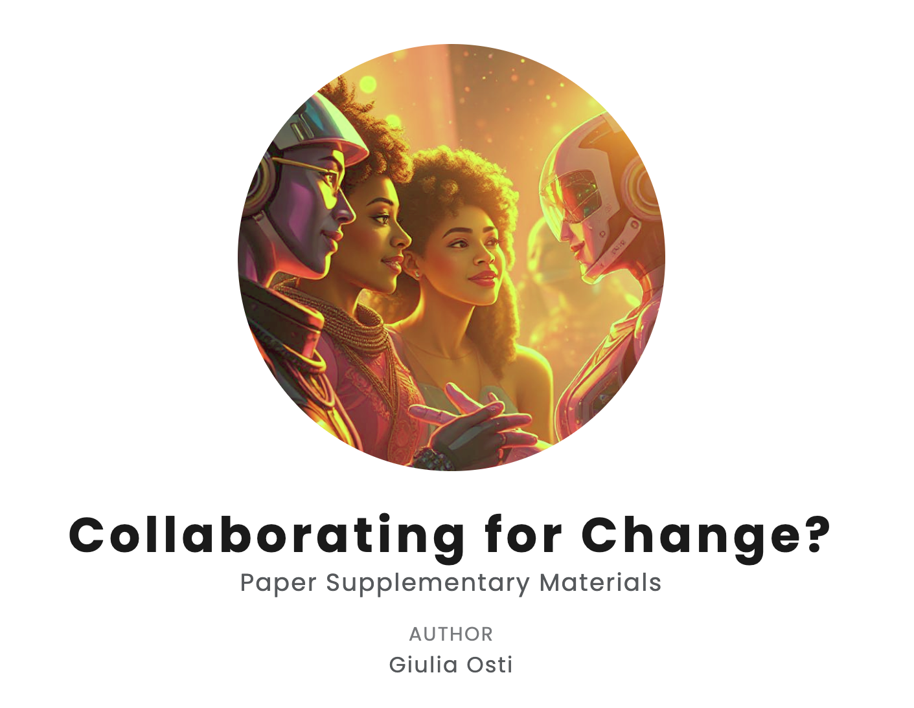

# Where do I find the supplementary materials?
I have organised the supplementary materials in a basic site using [Quarto](https://quarto.org/) as framework, so check that out:
[Website](https://semanticnoodles.github.io/collab-4-change/)

# Are they covered by any license?
I have picked the [CC BY 4.0 license](https://creativecommons.org/licenses/by/4.0/deed.en) to cover those extra contents; just remember to cite me if you use/remix the materials.
